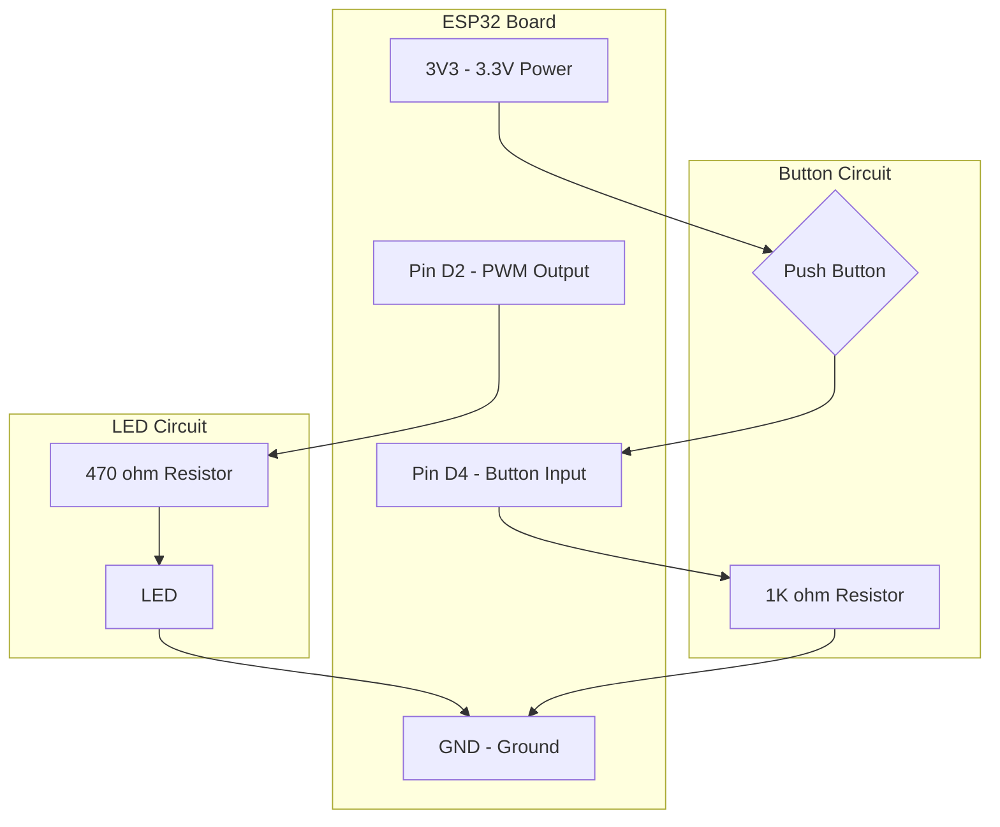

# ESP32 Robotics: Laboratory 1 - LED Brightness Control

This repository contains the guide, circuit diagrams, and code to build and run **Laboratory 1: LED Brightness Control Using a Push Button**.

---

## 📱 Do You Need to Create an App? (RemoteXY)

**No, you do not need to code an app from scratch.**

* **RemoteXY** is a platform where you can design a mobile dashboard (buttons, sliders, switches) on a website (https://remotexy.com) using a drag-and-drop editor.
* The website automatically generates the Arduino code for you to upload to your ESP32.
* You simply download the **RemoteXY mobile app** on your phone. When the ESP32 is powered on, the phone app connects to it (via Wi-Fi or Bluetooth) and automatically loads and displays the interface you designed.
* **For Laboratory 1**: The slides require using a **physical Push button/wire** to control the LED. RemoteXY is listed in the component kit but is not required for this first lab.

---

## 🛠️ Step-by-Step Walkthrough Guide

Follow these steps in order to set up your software, wire the physical components, and upload the code.

### Step 1: Install Arduino IDE
1. Open your web browser and go to: **[https://www.arduino.cc/en/software](https://www.arduino.cc/en/software)**
2. Under **Downloads**, click on **Windows Win 10 and newer, 64 bits** (or the version matching your computer).
3. On the next page, click **JUST DOWNLOAD**.
4. Run the downloaded installer file (`arduino-ide_xxxx.exe`).
5. Follow the installer instructions (agree to terms, click Next, click Install).
6. Once finished, open **Arduino IDE**.

### Step 2: Configure Arduino IDE for ESP32
1. Inside the Arduino IDE, go to **File > Preferences** (or press `Ctrl + Comma`).
2. Locate the box labeled **Additional boards manager URLs**.
3. Paste the following link into that box:
   `https://raw.githubusercontent.com/espressif/arduino-esp32/gh-pages/package_esp32_index.json`
4. Click **OK**.
5. On the left sidebar of the Arduino IDE, click on the **Boards Manager** icon (it looks like a small expansion board).
6. In the search bar at the top, type `esp32`.
7. Find the package named **esp32 by Espressif Systems** and click **Install**. Wait for the installation to finish (it might take a minute).

### Step 3: Connect ESP32 to Your Computer
1. Plug the small USB-C end of your cable into the ESP32 board's USB-C port.
2. Plug the standard USB end into your computer's USB port.
3. You should see a red light (`PWR`) light up on the ESP32 board, showing it has power.

---

## 🔌 Circuit Wiring Diagram

*Ensure the USB cable is unplugged from your computer while wiring to prevent accidental short circuits!*

We will connect:
* An **LED** to pin **D2** (GPIO 2).
* A **Push Button** to pin **D4** (GPIO 4).

### LED Circuit (Output)
1. Locate the **LED**. It has a long leg (positive, Anode) and a short leg (negative, Cathode).
2. Insert the LED into the breadboard (e.g., Long leg in Row 20, Column E; Short leg in Row 21, Column E).
3. Take the **470-ohm resistor** (stripes: Yellow-Violet-Brown).
   * Plug one leg of this resistor into the same row as the LED's **long leg** (Row 20).
   * Plug the other leg of the resistor into an empty row (e.g., Row 15).
4. Take a jumper wire.
   * Plug one end into the ESP32 shield pin labeled **D2**.
   * Plug the other end into the same row as the free resistor leg (Row 15).
5. Take another wire.
   * Plug one end into the row with the LED's **short leg** (Row 21).
   * Plug the other end into a pin labeled **GND** on the ESP32 shield.

### Push Button Circuit (Input)
We will use a **pull-down** resistor configuration, which ensures the ESP32 reads `LOW` (0V) when the button is open, and `HIGH` (3.3V) when pressed.
1. Place the push button so it straddles the center divider of your breadboard (e.g., across columns E and F, around Row 30).
2. Connect one of the top pins of the button to the **3V3** pin on the ESP32 shield using a wire.
3. Connect the opposite diagonal pin of the button to pin **D4** on the ESP32 shield using a wire.
4. Take your **1K-ohm resistor** (stripes: Brown-Black-Red).
   * Connect one leg of this resistor to the same pin **D4** connection at the button.
   * Connect the other leg of the resistor to **GND** on the ESP32 shield.



---

## 💻 Arduino IDE Code

Paste the following code into your Arduino IDE. This code implements the exact sequence required by your laboratory slide:

```cpp
/**
 * Laboratory 1: LED Brightness Control Using a Push button/wire
 * 
 * Sequence:
 * 1. Start: LED is OFF.
 * 2. Press switch: LED turns on at 25% brightness.
 * 3. Every 3 seconds: Brightness increases by 25% (25% -> 50% -> 75% -> 100%).
 * 4. At 100%: LED remains ON.
 * 5. Press button again: Reset sequence (LED OFF, wait for press).
 */

// Pin definitions
const int LED_PIN = 2;     // Connect LED long leg (via 470 ohm resistor) to D2
const int BUTTON_PIN = 4;  // Connect Button (via 1K ohm pull-down) to D4

// Sequence states
enum SequenceState {
  STATE_OFF,        // LED is OFF, waiting for button press
  STATE_25,         // LED is at 25% brightness
  STATE_50,         // LED is at 50% brightness
  STATE_75,         // LED is at 75% brightness
  STATE_100         // LED is at 100% brightness (ON)
};

// Variable declarations
SequenceState currentState = STATE_OFF;
unsigned long lastStepTime = 0;       // Keeps track of the 3-second timer
const unsigned long stepInterval = 3000; // 3 seconds in milliseconds

// Button debouncing variables
bool lastButtonState = LOW;
bool currentButtonState = LOW;
unsigned long lastDebounceTime = 0;
const unsigned long debounceDelay = 50; // 50ms to filter button noise

void setup() {
  Serial.begin(115200);
  
  // Set pin modes
  pinMode(LED_PIN, OUTPUT);
  pinMode(BUTTON_PIN, INPUT); // Expecting external 1K pull-down resistor
  
  // Ensure LED starts OFF
  analogWrite(LED_PIN, 0);
  Serial.println("System initialized. LED is OFF. Press button to start.");
}

void loop() {
  // Read the button state
  int reading = digitalRead(BUTTON_PIN);

  // Check if button state changed
  if (reading != lastButtonState) {
    lastDebounceTime = millis();
  }

  // If the state has persisted longer than the debounce delay, accept it
  if ((millis() - lastDebounceTime) > debounceDelay) {
    if (reading != currentButtonState) {
      currentButtonState = reading;

      // Detect button press (transition from LOW to HIGH)
      if (currentButtonState == HIGH) {
        handleButtonPress();
      }
    }
  }

  // Save the reading for next loop iteration
  lastButtonState = reading;

  // Handle the automatic brightness increase every 3 seconds
  handleTimer();
}

/**
 * Triggered whenever the button is pressed.
 */
void handleButtonPress() {
  if (currentState == STATE_OFF) {
    // Start the sequence at 25%
    currentState = STATE_25;
    analogWrite(LED_PIN, 64); // 25% of 255 is ~64
    lastStepTime = millis();  // Reset the 3-second timer
    Serial.println("Sequence started: LED at 25% brightness.");
  } else {
    // If the sequence is already running or complete, pressing resets it
    currentState = STATE_OFF;
    analogWrite(LED_PIN, 0); // Turn LED OFF
    Serial.println("Sequence reset: LED is OFF.");
  }
}

/**
 * Handles the automatic brightness increment every 3 seconds.
 */
void handleTimer() {
  // Only increment if we are in a running state and NOT at 100% yet
  if (currentState != STATE_OFF && currentState != STATE_100) {
    if (millis() - lastStepTime >= stepInterval) {
      lastStepTime = millis(); // Reset step timer

      switch (currentState) {
        case STATE_25:
          currentState = STATE_50;
          analogWrite(LED_PIN, 128); // 50% of 255 is ~128
          Serial.println("3 seconds elapsed: LED at 50% brightness.");
          break;
          
        case STATE_50:
          currentState = STATE_75;
          analogWrite(LED_PIN, 191); // 75% of 255 is ~191
          Serial.println("3 seconds elapsed: LED at 75% brightness.");
          break;
          
        case STATE_75:
          currentState = STATE_100;
          analogWrite(LED_PIN, 255); // 100% of 255 is 255
          Serial.println("3 seconds elapsed: LED at 100% brightness (Remain ON).");
          break;
          
        default:
          break;
      }
    }
  }
}
```

---

## 🚀 Uploading and Testing

1. Plug your ESP32 back into your computer's USB port.
2. In the top toolbar of Arduino IDE, click the dropdown menu that says **Select Board**.
3. Type `ESP32 Dev Module` in the search bar and select it.
4. Next to the board name, select the **COM Port** (e.g. `COM3` or `COM4`).
5. Click the **Upload** button (the arrow pointing to the right `->`).
6. When it says **"Done uploading."**, your code is running!
7. The LED will start OFF. Press the button once to start the sequence (25% -> 50% -> 75% -> 100%). Press the button again at any time to turn the LED OFF and reset.
